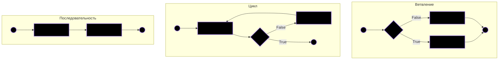

### Императивное программирование:
* в исходном коде программы записываются инструкции (команды)
* инструкции должны выполняться последовательно
* каждая инструкция может изменять некое глобальное “состояние” программы

### Структурное программирование
* ограниченное использование условных и безусловных переходов
* широкое использование подпрограмм и прочих управляющих структур (циклов, ветвлений, и т.п.)
* блочная структура

Концепция структурного программирования основана на теореме Бёма-Якопини:

> Любая вычислимая функция может быть представлена комбинацией трёх управляющих структур: 
> * последовательность (следование) - выполнение сначала одной подпрограммы, затем другой
> * цикл (итерация) - многократное выполнение подпрограммы пока некое булево выражение истинно
> * ветвление - выполнение либо одной, либо другой подпрограммы в зависимости от значения некого булева (логического) выражения

### Объектно-ориентированное программирование (ООП)

* основано на концепции "объекта"
* объекты могут содержать: 
  * данные (поля, свойства, аттрибуты)
  * поведение (код, процедуры, методы)

* наиболее популярной формой ООП является ООП на основе классов
  * все объекты являются экземплярами классов
  * классы определяют тип объектов

