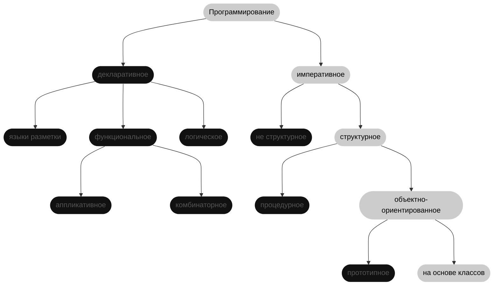

```mermaid
graph TD
    prog([Программирование]) ---> decl([декларативное])
    decl ---> markup([языки разметки]) & functional([функциональное]) & logical([логическое])
    functional([функциональное]) ---> applicative([аппликативное]) & combinatorial([комбинаторное])
    prog ---> imperative([императивное]) 
    imperative ---> non-structural([не структурное]) & structural([структурное])
    structural ---> procedural([процедурное]) & object-oriented([объектно-ориентированное]) 
    object-oriented ---> prototype([прототипное]) & klass-based([на основе классов])
   
    classDef stl fill:#ccc, color:#000,stroke-width:0px; 
    class prog,object-oriented,klass-based,structural,imperative stl;
    class structural_def,imperative_def stl;
    classDef default fill:#111,stroke-width:0px,color:#555;
```